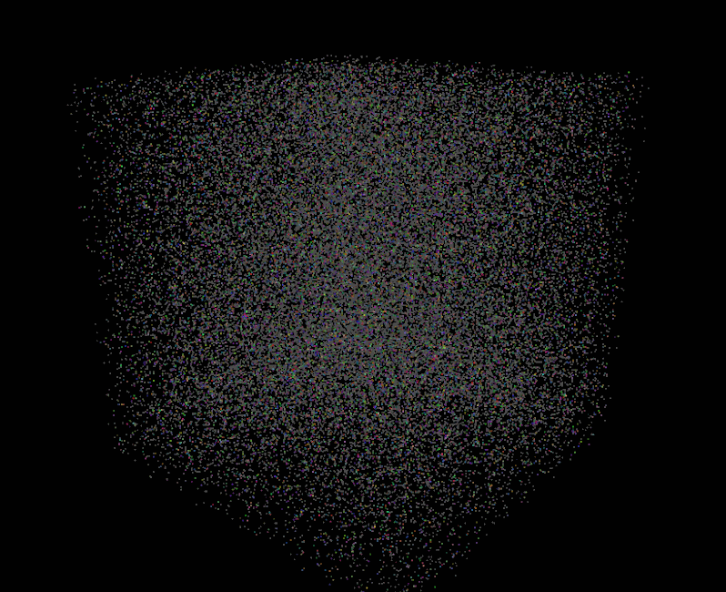
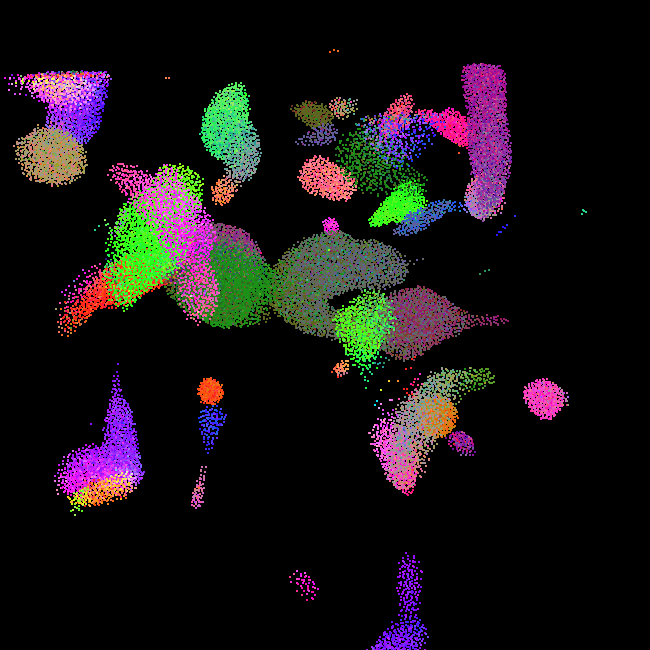
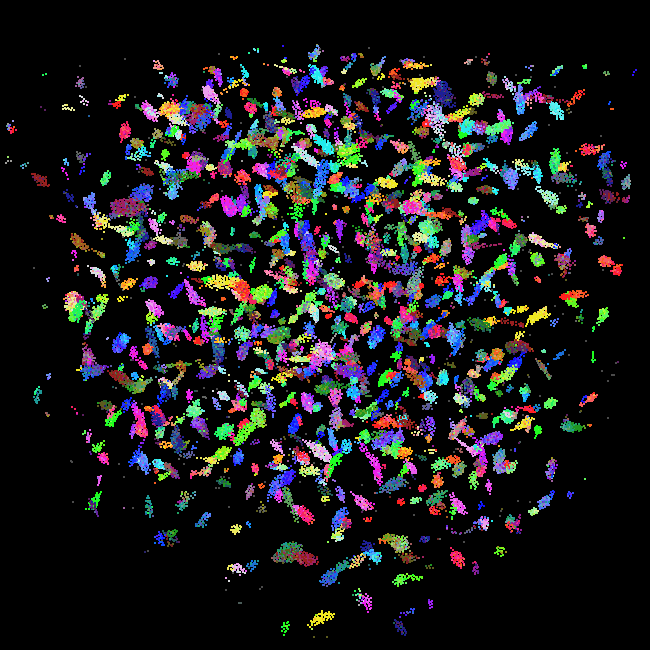
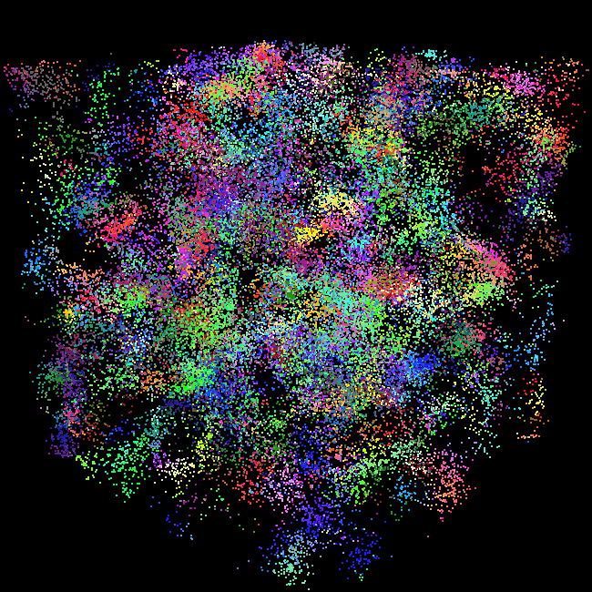

# CUDA Optimized Boids Simulation

**University of Pennsylvania, CIS 5650: GPU Programming and Architecture,
Project 1 - Flocking**

* Rin Fukuoka
  * [LinkedIn](https://www.linkedin.com/in/rin-fukuoka-4260772a2/) / [Personal website](https://www.rfukuoka.com/)
* Tested on: Windows 11, i9-13900HX @ 2.20 GHz, 32GB RAM, RTX 4080 Laptop GPU 12GB

  
   
  <em>50,000 boids, Coherent Uniform Grid Implementation</em>

  
  
  
   
  <em>Flocking parameter variations</em>

## Overview

In this project, I implemented a **Boids Simulation**, in which each particle (boid) models flocking behavior similar to that observed in birds or fish. Every boid follows three simple rules based only on its nearby neighbors:

1. **Cohesion** - move toward the average position of nearby boids.
2. **Separation** - steer away from boids that are too close.
3. **Alignment** - match velocity with nearby boids.

The boids algorithm is interesting because the overall flocking behavior emerges from each boid simply reacting to the neighbors near it. To simulate many boids using the GPU's parallelism, I explored a few ways to efficiently find those nearby boids. I made 3 implementations: 

**Naive Implementation**

Every boid checks every other boid in the simulation and computes distance to decide if it's a neighbor. This is simple to implement, but it's O(N²) work overall, so it gets slow fast as boid count grows.

**Scattered Uniform Grid Implementation**

Instead of checking every boid, I divide the simulation space into a grid of cells sized so a boid only needs to check a handful of nearby cells (8, or 27, depending on cell width) instead of the whole simulation. To build this grid on the GPU, each boid is labeled with the index of its cell, then all boids are sorted by that index. This groups boids in the same cell together in the sorted index array, so I can look up in parallel which boids belong to a given cell, without needing a per-cell resizable list. 

**Coherent Uniform Grid Implementation**

This builds on the scattered grid, but makes it more efficient: instead of leaving position/velocity data in place and looking it up indirectly, I physically rearrange it into the same sorted order as the grid. This removes the extra indirection and makes memory access more contiguous. 

## Performance Analysis

Performance was measured using FPS, averaged over 5 seconds after a brief startup warmup. All runs use a Release build with V-Sync off.

### FPS vs. Number of Boids by Implementation

#### Number of Boids

FPS decreases as boid count increases across all three implementations. The drop is steepest for naive, which checks every boid against every other boid (O(N²)). The grid-based methods scale far better since each boid only checks nearby cells; the coherent grid still holds 2,230 fps at N = 100,000 (visualization off).

#### Implementation Comparison

Both uniform grid methods generally outperform naive. At N = 100,000 with visualization off, naive/scattered/coherent run at 18/965/2,230 fps. The coherent grid gets faster scattered as N grows, since reordering boid data into contiguous memory removes the extra indirection through `dev_particleArrayIndices`.

At N = 1,000 with visualization off, naive is actually the fastest implementation (2,906 fps, vs. 2,524 for scattered and 2,486 for coherent). This suggests that with very few boids, brute-force checking is cheaper than building the grid (sorting cell indices, computing start/end offsets).

#### Visualization

Enabling visualization roughly halves FPS at low-to-moderate boid counts (coherent grid: 2,486 fps off vs. 1,222 fps on at N = 1,000), due to the added cost of copying boid data to the VBO and the OpenGL draw/swap calls each frame. This is close to a fixed per-frame cost, so its relative impact shrinks as N grows.

### FPS vs. Block Size

*Tested at N = 100,000 boids, visualization off.*

Block size has little effect on performance overall. This makes sense given we are using global memory rather than shared memory, so changing the block size has a limited effect on SM utilization. For naive, the bottleneck is memory bandwidth from checking all other boids rather than latency, so performance stays flat across block sizes. Scattered and coherent show somewhat more variation (~30-50%), likely because each thread checks far fewer boids, but the bottleneck is still global memory access rather than scheduling.

### Cell Width: 8 vs. 27 Neighboring Cells

I implemented two approaches to neighbor cell search. The first uses a cell width double the maximum neighbor distance, so only the 8 nearest neighboring cells need to be checked. The second uses a cell width equal to the maximum neighbor distance, requiring all 27 adjacent cells to be checked. This can be toggled with the preprocessor define `DoubleCellWidth`.

| # of Boids | 8 Cell | 27 Cell |
|---|---:|---:|
| 100,000 | 2,153 fps | 2,234 fps |
| 500,000 | 513 fps | 871 fps |
| 1,000,000 | 159 fps | 340 fps |

*Tested at N = 100,000-1,000,000 boids, block size = 128, visualization off.*

The data shows 27-cell outperforming 8-cell, and this gap widens as boid count increases. I suppose this is since a boid only interacts with others within its neighbor radius, the 8-cell method wastes more time checking boids that fall inside the searched cells but outside the true neighbor distance (only to be rejected by the distance check.) 
